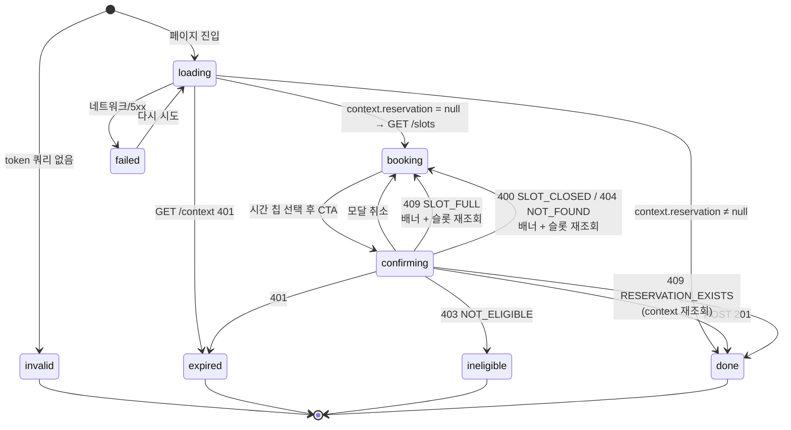

# 면접 슬롯 지원자 셀프 예약 페이지 (apps/web) 설계

- 작성일: 2026-09-01
- 상태: 설계 승인됨
- BE 계약: [DDD_BE#87](https://github.com/DDD-Community/DDD_BE/pull/87) (`feat/interview-booking`), BE 스펙 `docs/superpowers/specs/2026-08-29-interview-booking-design.md`

## 1. 배경

BE 가 지원자 셀프 예약 API 3종을 구현했다(DDD_BE#87, 머지 전). 서류합격 메일에 서명 토큰
링크가 담겨 나가고, 지원자는 그 링크로 들어와 자기 직군의 열린 슬롯을 직접 고른다.

이 문서는 그 링크가 도착할 **프론트 페이지**의 설계다. BE PR 의 "배포 전 필요 사항"에
남아 있는 두 항목 중 프론트 몫에 해당한다.

## 2. 범위 / 비범위

**범위**

- `/interview/booking` 페이지 (apps/web, Next.js App Router)
- 토큰 Bearer 인증 fetch 모듈 (쿠키 기반 `@ddd/api` 싱글턴과 분리)
- 슬롯 목록(날짜 그룹 + 시간 칩), 확인 모달, 예약 확정 화면
- BE 에러 코드 6종의 화면 처리

**비범위**

- 지원자 셀프 변경·취소 — BE 에 API 자체가 없다
- 실시간 잔여석 갱신 — BE 설계가 YAGNI 로 배제, 409 + 재조회로 갈음
- 토스트 인프라 신설 — apps/web 에 없고 이 페이지 하나 때문에 도입하지 않는다 (인라인 배너로 대체)
- `@ddd/api` 로의 도메인 편입 — 아래 §4 참조

## 3. 라우트와 파일 구조

기존 web 관례(페이지 셸 + `components/sections` + `lib/api`)를 따른다.

```
apps/web/
├── app/interview/booking/page.tsx                  # 서버 셸: metadata(noindex) + 섹션 렌더
├── components/sections/InterviewBookingSection.tsx  # "use client" — 상태 머신 + 화면
├── components/modals/BookingConfirmModal.tsx        # 확인 모달
├── lib/api/interview-booking.ts                     # Bearer fetch 3종 + 타입 + 에러
└── lib/mappers/interviewBookingSlots.ts             # 순수 헬퍼(날짜 그룹핑·KST 포맷)
```

라우트는 BE env 예시(`INTERVIEW_BOOKING_URL = https://…/interview/booking`)와 일치시킨다.
`page.tsx` 에 `robots: { index: false, follow: false }` — 토큰 링크 전용 페이지라 색인 대상이 아니다.

Navigation/Footer 는 넣지 않는다. 메일에서 단일 목적으로 진입하는 페이지이고, 전역 내비게이션은
예약 도중 이탈 경로만 만든다. 대신 기존 `constants/tokens` 의 컬러·타이포와
`components/ui/Button` 을 그대로 쓴다.

## 4. API 모듈 — 왜 `@ddd/api` 가 아닌가

예약 API 는 **Bearer 예약 토큰** 인증이다. `@ddd/api` 싱글턴은 `credentials: "include"` 쿠키
세션 전제로 configure 되어 있어(`lib/api/config.ts`), 같은 클라이언트에 Bearer 경로를 얹으면
인증 방식이 둘로 갈린다. 또 BE PR 이 머지 전이라 `pnpm gen:api` 로 타입을 뽑을 수도 없다.

따라서 `lib/api/interview-booking.ts` 에 **로컬 fetch 모듈**을 둔다. BE 가 머지되고 openapi 에
공개 API 가 올라오면 이 파일의 수기 타입을 생성 타입으로 교체할 수 있다(호출부 시그니처는 유지).

### 4.1 타입 (BE `interview-booking.response.dto.ts` 미러)

```ts
export type BookingSlot = {
  id: number
  startAt: string        // ISO. BE 는 Date 를 직렬화해 내려준다
  endAt: string
  location?: string
  remainingSeats: number // 0 이면 마감 — 목록에는 포함된다
}

export type BookingReservation = {
  id: number
  slotId: number
  startAt?: string       // BE DTO 가 slot 관계에서 채우므로 optional
  endAt?: string
  location?: string
}

export type BookingContext = {
  applicantName: string
  partName: string
  reservation: BookingReservation | null
}
```

### 4.2 함수

```ts
fetchBookingContext(token: string): Promise<BookingContext>          // GET  /context
fetchBookingSlots(token: string): Promise<BookingSlot[]>             // GET  /slots
createBookingReservation(token, slotId): Promise<BookingReservation> // POST /reservations
```

응답 봉투는 BE 공통 `{ code, message, data }` 이며, 모듈이 `data` 만 벗겨 반환한다.

### 4.3 에러

```ts
export class BookingApiError extends Error {
  readonly code: string
  readonly status: number
}
```

`ok` 가 아니면 봉투의 `code`/`message` 로 던진다. 봉투 파싱 자체가 실패하면
`code = "UNKNOWN_ERROR"`, `status` 는 HTTP 상태를 담는다. BE `message` 는 그대로 노출 가능한
한국어라 화면이 사유를 못 찾을 때의 폴백 문구로 쓴다.

## 5. 화면 상태 흐름

섹션이 단일 상태 머신을 갖는다. 라이브러리는 쓰지 않는다(web 에 TanStack Query 미도입).



| 상태 | 화면 |
|---|---|
| `loading` | 스켈레톤/스피너 |
| `invalid` | "잘못된 접근입니다. 메일의 예약 링크로 다시 들어와 주세요" |
| `expired` | "링크가 만료되었습니다. 운영진에게 문의해주세요" |
| `ineligible` | "지금은 예약할 수 있는 상태가 아니에요. 운영진에게 문의해주세요" |
| `booking` | 헤더 + 날짜 그룹 + 시간 칩 + 하단 고정 CTA (+ 에러 배너) |
| `confirming` | `booking` 위에 확인 모달 |
| `done` | 예약 확정 카드 |
| `failed` | "정보를 불러오지 못했어요" + 다시 시도 |

### 5.1 `booking` 화면

- 헤더: `{applicantName}님, 면접 시간을 선택해주세요` / 부제에 `{partName}` 직군 표기
- 날짜 그룹: `9월 10일 (수)` 헤딩 아래 시간 칩 그리드 (모바일 2열, 그 이상 3~4열)
- 칩: `14:00 ~ 14:40`(startAt~endAt 레인지) + 하단에 `2자리 남음`. `remainingSeats === 0` 은 `disabled` + `마감`
- 선택 시 칩 강조, 하단 고정 바의 CTA(`이 시간으로 예약`) 활성화
- 슬롯 0건: "아직 열린 면접 시간이 없어요. 운영진에게 문의해주세요"
- 에러 배너: 목록 상단 인라인. `SLOT_FULL` 은 "방금 마감되었어요. 다른 시간을 골라주세요"

### 5.2 확인 모달

일시·장소를 다시 보여주고, **"확정 후에는 직접 변경·취소할 수 없어요. 변경이 필요하면 운영진에게
문의해주세요"** 를 경고로 노출한다. 되돌릴 수 없는 행동이라 2단 확인을 둔다.

### 5.3 `done` 화면

일시·장소 + "확정 안내 메일을 보내드렸어요(캘린더 초대 포함)" + 변경 문의 안내.
토큰은 만료 전까지 재사용 가능하므로, 재접속하면 `context` 가 예약을 돌려줘 항상 이 화면이 된다.

## 6. 시간 표기 — KST 고정

BE 는 UTC ISO 로 내려준다. 브라우저 로컬 타임존으로 포맷하면 해외 체류 지원자에게 다른 시각이
보인다. 면접은 KST 기준 하나뿐이므로 `Intl.DateTimeFormat("ko-KR", { timeZone: "Asia/Seoul" })`
로 **명시적으로 고정**한다. 날짜 그룹핑 키도 같은 타임존에서 뽑아야 자정 근처 슬롯이 다른 날짜
그룹으로 새지 않는다.

> 같은 실수가 어드민에서 이미 한 번 났다 — 슬롯 등록이 오프셋 없는 naive ISO 를 보내 저장이
> +9h 밀렸다(커밋 `f4ff277`). 그 교훈으로 이 페이지는 표시 경로의 타임존을 명시한다.

## 7. 토큰 취급

- `useSearchParams()` 로 `?token=` 을 읽어 컴포넌트 상태로만 보관한다.
- `localStorage`/`sessionStorage` 에 저장하지 않는다 — 재접속은 메일 링크 재클릭으로 충분하고,
  토큰에 지원자 이름·직군이 들어 있어 저장은 불필요한 PII 잔존이다.
- 토큰을 URL 에서 지우지는 않는다(새로고침 시 재진입이 깨진다).

## 8. 검증 계획

apps/web 에는 테스트 러너가 없다. 게이트는 `pnpm --filter @ddd/web build` + `pnpm lint`.

순수 헬퍼(`lib/mappers/interviewBookingSlots.ts`)는 node 원라이너로 전/후 값을 확인한다:

- KST 그룹핑: `2026-09-10T14:50:00Z`(= KST 9/10 23:50) 와 `2026-09-10T15:10:00Z`(= KST 9/11 00:10)
  가 **다른 날짜 그룹**으로 갈리는지
- 포맷(칩 레인지): `startAt=2026-09-10T05:00:00Z, endAt=2026-09-10T05:40:00Z` → `14:00 ~ 14:40`
- 정렬: 날짜 그룹과 그룹 내 시간이 모두 오름차순인지

BE 머지 후 실링크로 수동 확인할 항목(스펙에 남김): 401/403 화면, 409 경합 배너, 확정 메일 수신.

## 9. 후속 (이 범위 밖)

- BE 머지 → `pnpm gen:api` → 수기 타입을 생성 타입으로 교체
- 운영 env `INTERVIEW_BOOKING_URL` 설정 (BE PR 체크리스트 항목)
